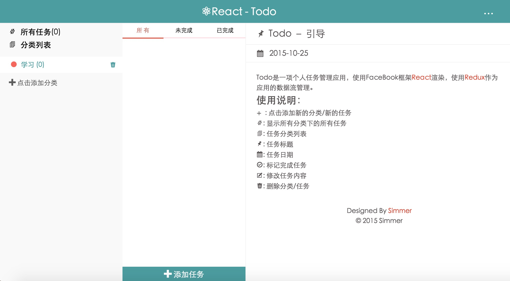
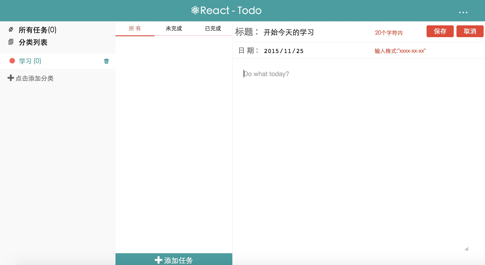
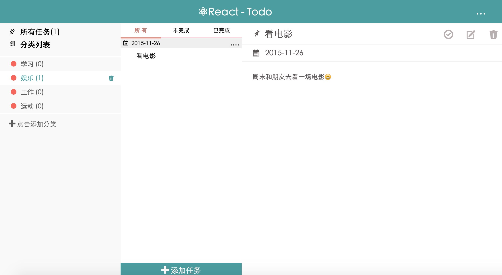
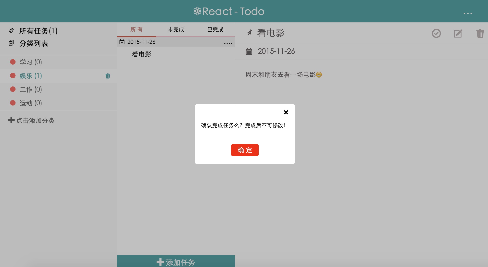
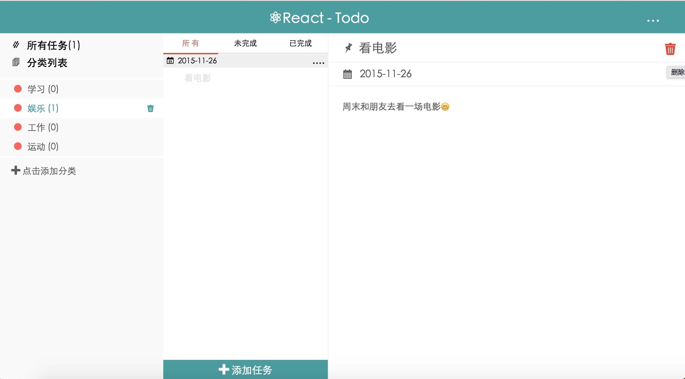

# React - Todo #
For rebuild Todo App use [React](https://facebook.github.io/react/) and [Redux](https://github.com/rackt/redux).

## File Intro ##

    /app                        // The product folder
        /css                    // The stylesheet folder
        /fonts                  // icon font folder
        /js                     // javascrit code folder
            /action             // redux action folder
                action.js       // redux action
            /component          // React component folder
                alert.js
                class.js
                content.js
                task.js
                todoApp.js
            /lib                // The original library folder
                react-dom.js
                react-redux.js
                react.js
                redux.js
                require.js
            /pubsub
                pubsub.js       // for react component communication use pubsub design mode
            /reducer
                reducer.js      // redux reducer for the state tree
            /store
                text.js         // just for simulate the action not use in production 
            config.js           // configuration require base path
            main.js             // the SPA entrance file

## Begin ##

 * Clone Repository from here.
 * Run npm install.
 * Open the file `/workflow` and enjoy you code!

## Demo ##

 * Online demo [here](http://hisimmer.com/React-Todo/) 
 * You can see the online demo [here](http://hisimmer.com/React-Todo/) or clone this repository and open the `app/index.html` to show! Enjoy it.

 

 

 

 

 

## Future ##

For now it does'n support mobile, but it will support soon...(so makesure you screen big than 980px...)

If you hava any question just open issue .

## LISENCE ##

MIT  © 2015 Simmer .